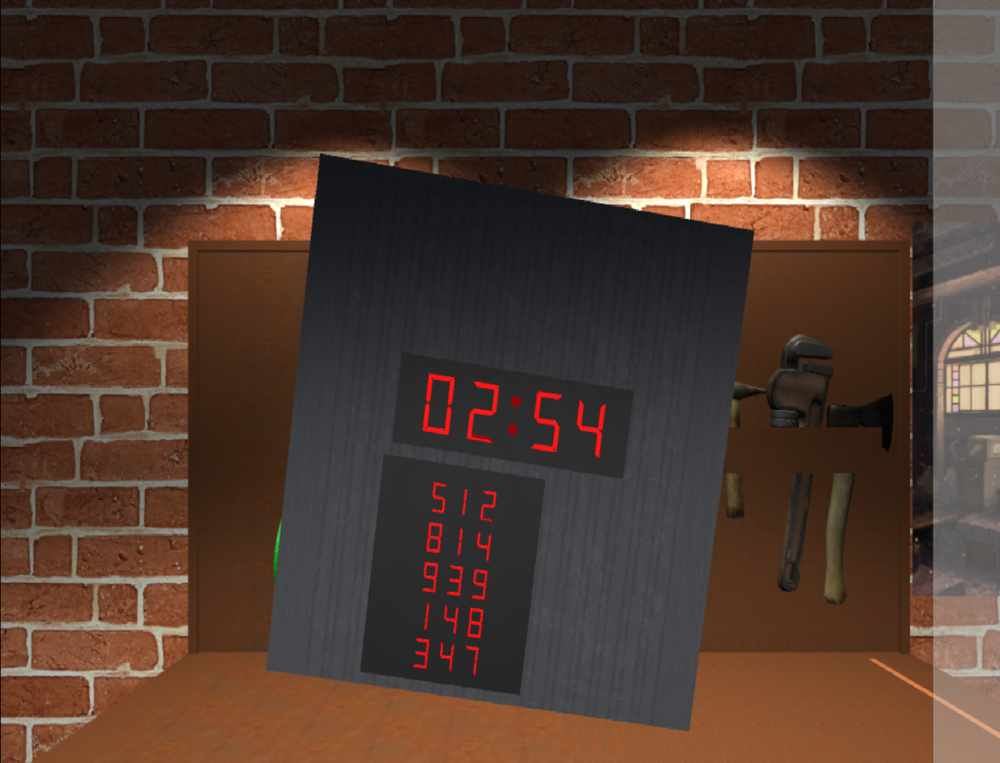
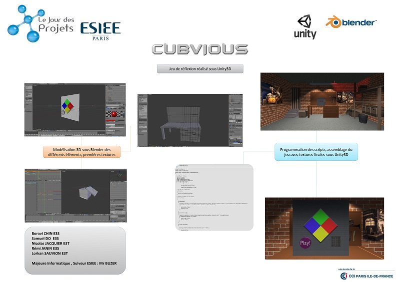
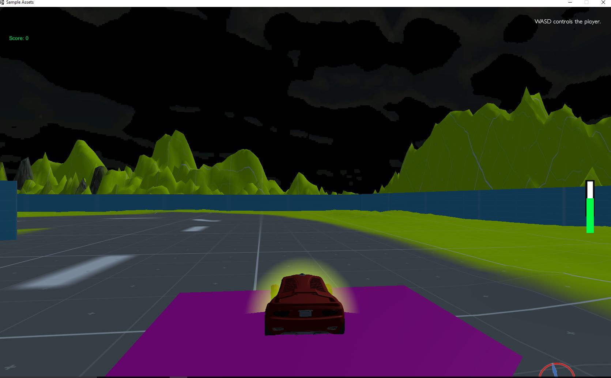
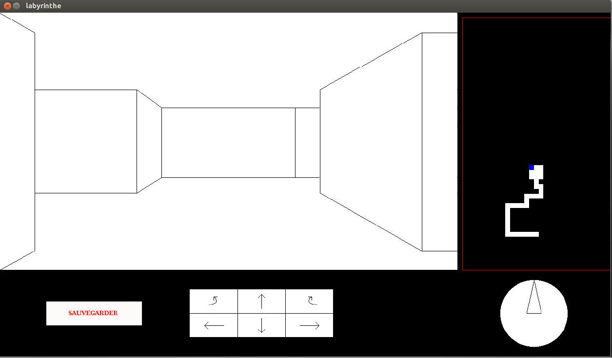
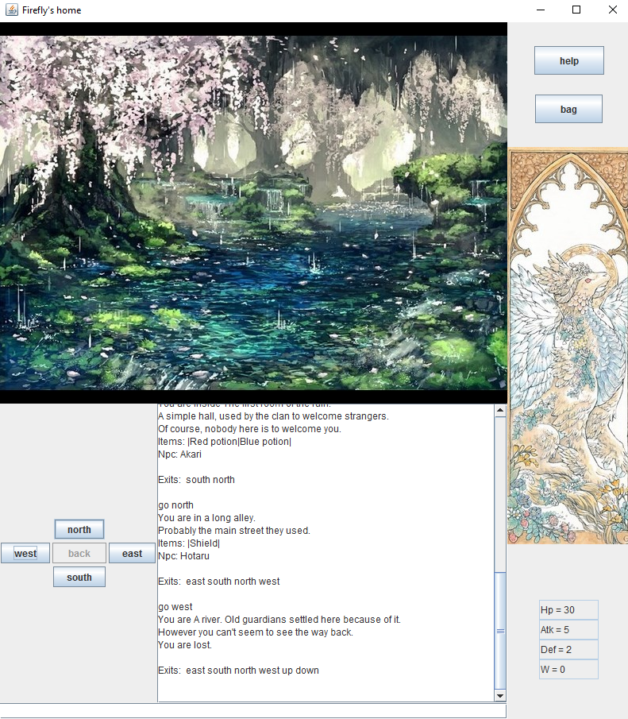

## Projets

Ci-Dessous les divers projets de jeux vidéo que j'ai pu faire.

### Cubvious


Jeu de puzzle fait avec Unity3D et C#.

Fait dans le cadre d'un projet de 3 mois en 1ère année à l'ESIEE Paris.

[Lien vers le projet](https://drive.google.com/open?id=0B0pxW2mxEZiYd3RxVFlLZFdLLVk)



### Proto jeu de course


Proto de jeu de course fait avec Unity3D et C#.
Mario kart-like avec carapaces rouges, vertes, pistes de turbo, checkpoints etc...

### Labyrinthe

```markdown
Jeu de labyrinthe fait en C avec la librairie MLV
Carte dynamique selon l'avancé du joueur dans le labyrinthe et possibilité de sauvegarde de sa progression.
```
[Lien vers le projet](https://drive.google.com/open?id=0B0pxW2mxEZiYb0JreE5CdEJXN28)

### Jeu Texte


```markdown
Jeu textuel en Java.
Le joueur rentre les mots clés associés pour entreprendre des actions.
(Note : La commande Talk ne marche pas complétement)
```
[Lien vers le projet](https://drive.google.com/open?id=0B0pxW2mxEZiYMFdKbUdxLU13Tzg)

### Jeu de Stratégie - Ere des barons

```markdown
Jeu de Stratégie au tour par tour en C
Chaque joueur possède plusieurs unités avec plusieurs actions disponibles.
```
