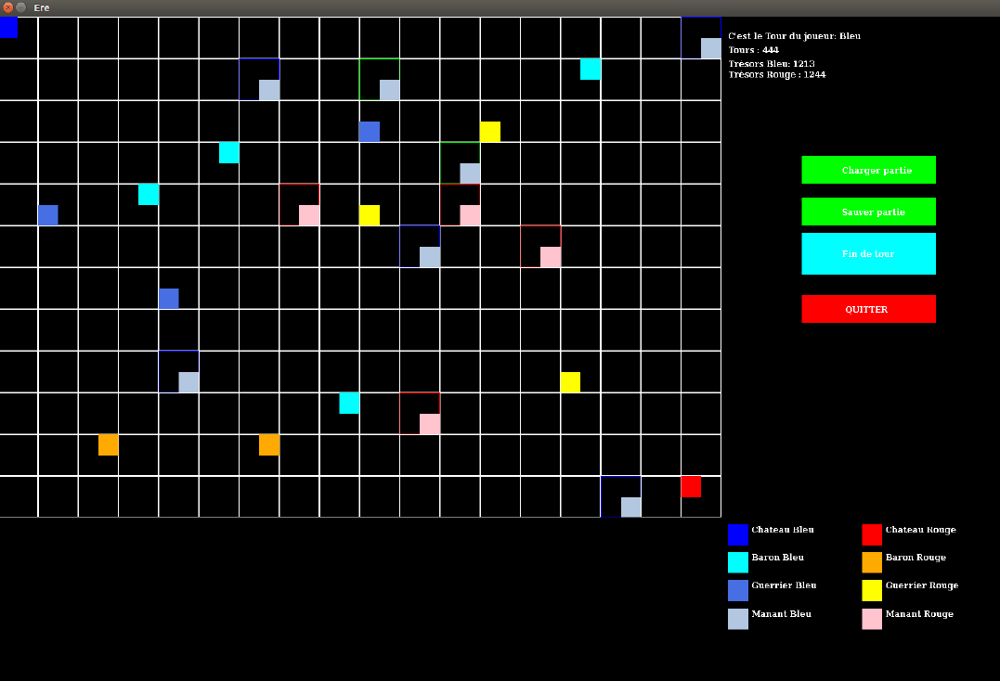

## Projets

Bonjour à tous ! 

Ci-Dessous ce trouvent les divers projets de jeux vidéo que j'ai réalisé.

### Cubvious

Puzzle game. Création en Unity3D et C#.

[Lien vers le projet](https://drive.google.com/open?id=0B0pxW2mxEZiYd3RxVFlLZFdLLVk)

### Proto jeu de course

Prototype de jeu de course. Création en Unity3D et C#.

Mario kart-like avec carapaces rouges, vertes, pistes de turbo, checkpoints etc...

### Labyrinthe

Jeu de labyrinthe. Création en C avec la librairie MLV.

Carte dynamique selon l'avancement du joueur dans le labyrinthe et possibilité de sauvegarde de sa progression.

[Lien vers le projet](https://drive.google.com/open?id=0B0pxW2mxEZiYb0JreE5CdEJXN28)

### Jeu Texte

Jeu textuel. Création en Java, Java Swing.

Le joueur rentre les mots clés associés pour entreprendre des actions.

(Note : La commande Talk ne marche pas complétement)

[Lien vers le projet](https://drive.google.com/open?id=0B0pxW2mxEZiYMFdKbUdxLU13Tzg)

### Jeu de Stratégie - Ere des barons

Jeu de Stratégie au tour par tour. Création en C.

Chaque joueur possède plusieurs unités avec plusieurs actions disponibles.
